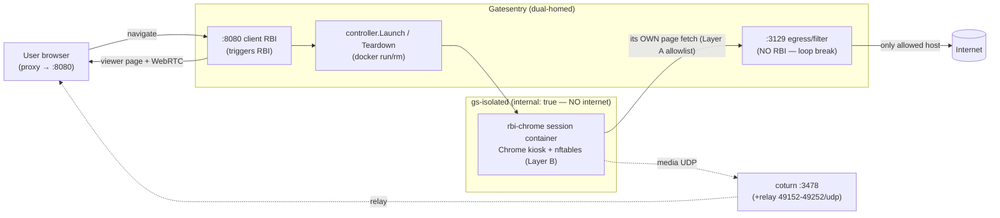

# Per-session Remote Browser Isolation (RBI)

A user's HTTPS request is rewritten by Gatesentry into a WebRTC viewer page. The
real browsing happens in a **fresh, throwaway Google-Chrome container** locked to
**one URL**, with **two independent egress layers**, and is **destroyed on
disconnect**. Only pixels + audio reach the user.

## Architecture



ASCII summary of the egress paths:

```
client ──:8080──> Gatesentry(RBI)            ── viewer/signalling ──> session neko
session Chrome ──forced proxy──> Gatesentry(:3129 egress) ──allowlist──> Internet
session media ──EPR udp──> coturn ──relay──> client
   (everything else OUT of the session container is DROPPED by nftables)
```

## The two egress layers (defense-in-depth)

| Layer | Where | Enforces |
|------|-------|----------|
| **A — proxy allowlist** | Gatesentry `:3129` egress listener + Chrome `ProxySettings` fixed_servers | The session's Chrome is *forced* through `:3129`; it permits only hosts of active sessions (`controller.IsEgressAllowed`). Content filtering also runs here. |
| **B — in-container firewall** | `nftables` in the session container (`entrypoint.sh`) | `output policy drop`. Allows only: loopback, DNS→docker resolver, TCP→egress proxy, TURN control, WebRTC media UDP range. A rogue tab that ignores the proxy still reaches nothing. |
| **(network)** | `gs-isolated` `internal: true` | Session containers have no internet gateway at all — the web is reachable *only* via the dual-homed proxy. |
| **(browser)** | Chrome managed policy | `URLBlocklist:["*"]` + `URLAllowlist:[host]`, forced start URL, devtools/downloads/popups/sync off. |

## Loop avoidance (critical)

The client path (`:8080`) rewrites top-level navigations into the RBI viewer.
The session's Chrome must fetch its target **without** being re-isolated — else
infinite loop. So the isolated browser is pointed (via Chrome `ProxySettings`) at
a **separate listener `:3129`** where **RBI rewriting is disabled** (`rbiEnabled
= false`); it only filters + forwards. Distinct listener = unambiguous, no header/
cookie sniffing needed. (`:3129` is never published to the host — reachable only
on `gs-isolated`.)

## Capabilities

Session containers run `--cap-drop=ALL --security-opt no-new-privileges` plus
**only `NET_ADMIN`** (required for `nftables`). Chrome runs `--no-sandbox` (the
throwaway container *is* the sandbox) so `SYS_ADMIN` is not needed. If your neko
image's Chrome requires its own sandbox, add `--security-opt seccomp=unconfined`
rather than `SYS_ADMIN`, and document it.

## Build & run

```bash
# 1. build the session image
docker build -t rbi-chrome:latest ./rbi-chrome

# 2. provide secrets/host info (never commit these)
export PUBLIC_IP=<your.host.public.ip>
export TURN_SECRET=$(openssl rand -hex 32)
export TURN_REALM=rbi.local

# 3. bring up the control plane (Gatesentry + coturn + networks)
docker compose up -d
docker network ls | grep gs-isolated   # confirm RBI_ISOLATED_NETWORK matches compose env

# 4. point a browser's HTTPS proxy at <gatesentry-host>:8080 and visit a site
```

`neko` version: targeting **v3** (`NEKO_WEBRTC_*`, `NEKO_MEMBER_*`). Lines that
differ between v2/v3 are flagged `# NEKO-V3` in the Dockerfile, entrypoint and
controller — verify them against your image:
`docker run --rm --entrypoint env <image> | grep -i neko`.

## Verifying each acceptance criterion

1. **Two users → two clean containers.** Open two sessions; `docker ps` shows two
   `rbi-<id>` containers. Profiles are clean (`--rm`, fresh container, no shared
   volume). `docker inspect -f '{{.GraphDriver}}' rbi-<id>` differ.
2. **Navigation to another domain refused (browser + network).**
   - Browser: in the streamed session, type `https://evil.test` → Chrome shows
     *"Blocked by your administrator"* (URLBlocklist).
   - Network: `docker exec rbi-<id> nft list ruleset` shows `policy drop`;
     `docker exec rbi-<id> curl -m3 https://1.1.1.1` → **fails** (no route),
     while the allowed host via the proxy works.
3. **Popup has no internet (Layer B proof).** `docker exec rbi-<id> bash -c \
   'curl -m3 https://example.org'` (simulating a rogue tab bypassing the proxy)
   → blocked; `nft list table inet rbi` counters on the drop rule increment.
4. **Audio + video play.** Connect to the viewer; a video page (e.g. youtube
   watch) shows moving frames and audible sound (neko Chrome ships H.264/AAC +
   PulseAudio; media relays via coturn).
5. **No re-isolation loop.** `docker logs rbi-<id>` shows the page loading once;
   Gatesentry's `:3129` access log shows the session's fetch handled in egress
   mode (no `Launch`/viewer-rewrite). The viewer renders the page, not another
   viewer.
6. **Teardown on disconnect within N s.** Close the client tab; within
   `RBI_IDLE_TIMEOUT` (default 120s; immediate on explicit disconnect) the GC
   runs `docker rm -f` — `docker ps` no longer lists the container.
