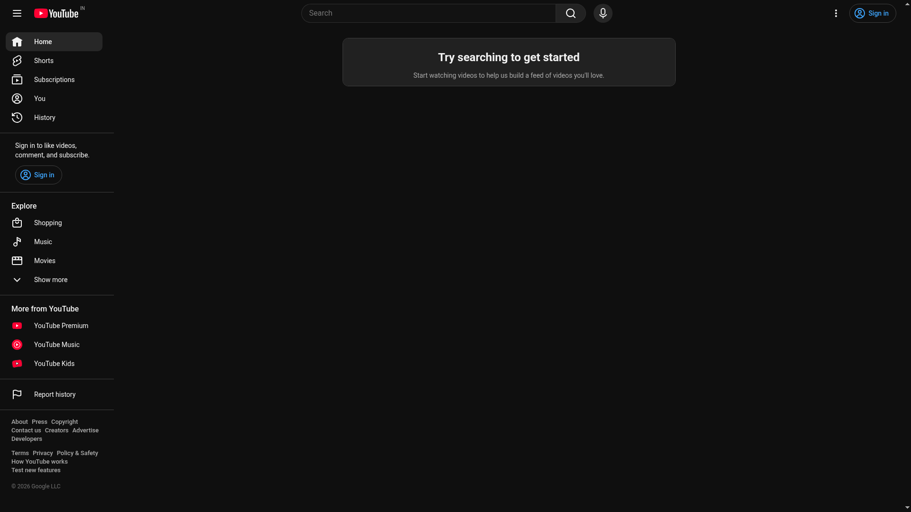
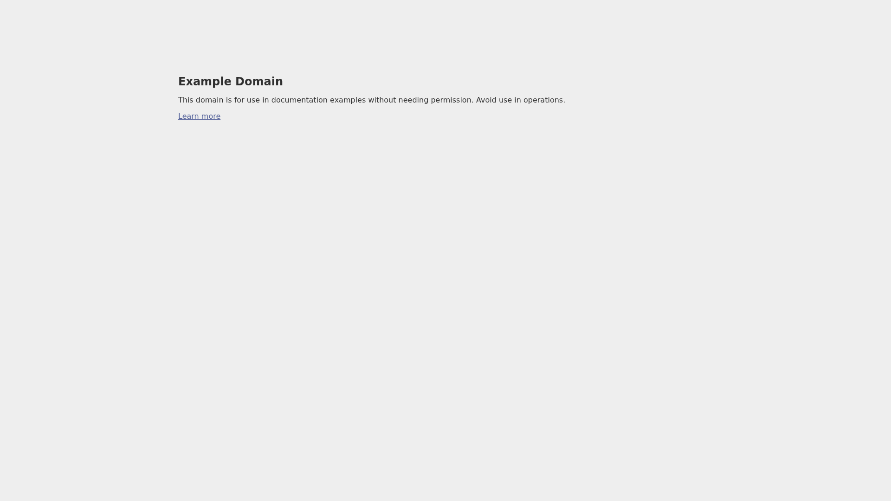
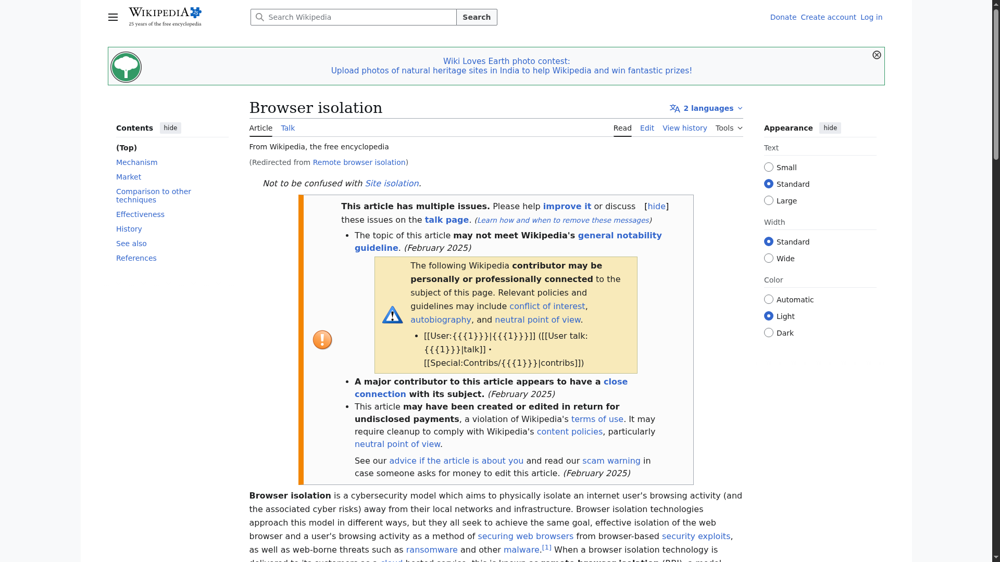

# TLS-Termination Proxy + Remote Browser Isolation (RBI)

A consent-based, content-filtering web gateway that **terminates TLS (SSL-bump)**, inspects/filters traffic, and — for risky or selected sites — transparently opens them in a **throwaway, sandboxed cloud browser**, streaming back only pixels. The user's real device never touches the risky page.

> This is legitimate defensive security infrastructure (the model behind enterprise secure web gateways): TLS interception works only because the client is deliberately configured to trust the gateway's CA.

---

## What it does

1. **You can't filter what you can't see.** Modern traffic is HTTPS, so the gateway terminates TLS, mints a CA-signed leaf cert on the fly, inspects the plaintext, applies policy (blocked hosts, MIME types, words, time rules, YouTube restrictions), then re-encrypts.
2. **Even allowed sites can be dangerous.** Instead of blindly allowing or blocking, the gateway **isolates**: the page runs in a disposable container; the user only receives a live WebRTC video stream. No page code ever executes on the user's machine.

---

## Screenshots

**Isolated browser is kiosk-locked to a single URL — no tabs, no address bar, no escape:**



**Driven end-to-end through the proxy** — navigating a site spins up a fresh per-session container that renders it in isolation:





---

## How it works (runtime flow)

```
Client (trusts CA, proxy set)
        │  https://site.com  (top-level navigation)
        ▼
Gatesentry proxy :8080
   • peek ClientHello / SNI, mint CA-signed leaf cert (SSL-bump)
   • run content filters → allow / block / ISOLATE
        │  (isolate)
        ▼
Launch FRESH per-session container  ── rbi-chrome-neko ──
   • complete Chromium, kiosk-locked to the one URL
   • nftables default-DROP egress, URL allowlist policy, CA trusted
        │
        ▼
Proxy returns a page → window.open(localhost:PORT)  ── NEW WINDOW
        │
        ▼
WebRTC pixel stream of the isolated browser  →  idle → container destroyed
```

## Security model (defense in depth)

| Layer | Mechanism |
|------|-----------|
| Per-session isolation | one throwaway container per session, no shared profile |
| Egress allowlist (Layer A) | container only reaches the active session's own host |
| Container firewall (Layer B) | `nftables` default-DROP; only DNS, egress proxy, TURN allowed |
| URL lockdown | Chromium managed policy: `URLBlocklist:["*"]` + one-host allowlist, kiosk (no tabs) |
| Least privilege | docker default caps + only `NET_ADMIN`, `no-new-privileges` |
| Fail-closed | container exits before the browser starts if firewall/policy can't be verified |
| Teardown | idle sessions reaped; nothing persists |

---

## Quick start (single x86-64 Linux host)

```bash
# 1. configure (copy the examples, fill in your own secrets)
cp Gatesentry/config.example.json Gatesentry/config.json     # set your CA cert/key
cp Gatesentry/rbi/rbi.env.example  Gatesentry/rbi/rbi.env     # set TURN_SECRET, PUBLIC_IP

# 2. build the per-session isolation image
docker build -t rbi-chrome-neko:latest Gatesentry/rbi/rbi-chrome

# 3. build & run the proxy
cd Gatesentry && go build -o bin/ ./... && ./bin/gatesentrybin config.json   # :8080 proxy, :8001 PAC
```

Then point the client browser at the proxy (`:8080`) and trust the gateway CA (`Gatesentry/rbi-ca.cert.pem`). Navigating any `https://` site opens a fresh isolated window.

> ⚠️ **Secrets are not committed.** `config.json` (CA private key) and `rbi.env` (TURN secret) are git-ignored — copy the `*.example` files and supply your own.

## Production note

Runs best on **native x86-64** (smooth WebRTC video encode; ARM emulation is slow). On production set **`RBI_PROXY_DEMO_DIRECT=0`** to enable the full Layer-B firewall + forced egress proxy (the demo default of `1` skips them so it renders on dev machines). See [Gatesentry/DEPLOY-x86.md](Gatesentry/DEPLOY-x86.md).

---

## Repo layout

| Path | What |
|------|------|
| [Gatesentry/gatesentryproxy/](Gatesentry/gatesentryproxy) | TLS-bump proxy + per-session RBI launcher (`rbi_session.go`) + controller |
| [Gatesentry/rbi/rbi-chrome/](Gatesentry/rbi/rbi-chrome) | the per-session isolation browser image |
| [Gatesentry/application/](Gatesentry/application) | filters, DNS, app core |
| [tlsproxyQT/](tlsproxyQT) | parallel native Qt6 + OpenSSL3 SSL-bump implementation |
| [PROJECT-OVERVIEW.md](PROJECT-OVERVIEW.md) | full architecture write-up |

## License

See [Gatesentry/LICENSE](Gatesentry/LICENSE).
